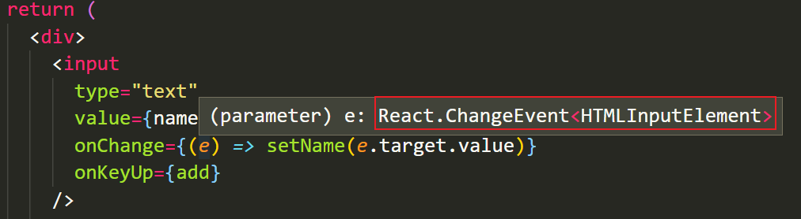

# React项目中使用TypeScript

## useEffect的使用

**目标：**能够掌握useEffect在TS中的使用

**内容**：

`useEffect`函数不涉及到任何类型，TS 和 JS 中使用一致

```tsx
useEffect(() => {
  const onResize = () => {
    console.log('哈哈哈')
  }
  window.addEventListener('resize', onResize)

  return () => {
    window.addEventListener('resize', onResize)
  }
}, [])
```

## useState的使用

**目标**：能够掌握useState在TS中的使用

**内容：**

+ `useState` hook 是一个泛型函数，接收一个类型变量来指定状态的类型

```tsx
// 指定 name 状态的类型为：string
const [name, setName] = useState<string>('jack')
// 指定 age 状态的类型为：number
const [age, setAge] = useState<number>(28)
```

+ 注意：该类型变量，不仅指定了状态的类型，也指定了 setName 等修改状态函数的参数类型

```tsx
const [name, setName] = useState<string>('jack')
// 此时，setName 的参数的类型也是 string
setName('rose')
// 错误演示：
// setName(18)
```

省略类型变量，简化 `useState` 的调用：

+ 在使用 useState 时，只要提供了初始值，TS 就会自动根据初始值来推断出其类型，因此，可以省略类型变量
+ 注意：如果 TS 自动推断出来的类型不准确，还得显式指定泛型类型

```tsx
const [name, setName] = useState('jack')
```

## useState明确指定泛型类型

**目标：**能够明确指定useState的泛型类型

**内容：**

- 需求：获取频道列表数据并渲染

+ 频道列表数据的接口：http://geek.itheima.net/v1_0/channels

```jsx
// 比如，频道列表数据是一个数组，所以，在 JS 中我们将其默认值设置为：[]
// 但是，在 TS 中使用时，如果仅仅将默认值设置为空数组，list 的类型被推断为：never[]，此时，无法往数组中添加任何数据
const [list, setList] = useState([])
```


- 注意：useState 的初始值是数组、对象等复杂的数据类型，需要明确指定泛型类型
  - 因为虽然都是数组、对象，但是，项目开发中不同需求所需要的数组结构、对象结构是不同的。因此，需要明确指定其类型

```ts
type Channel = {
  id: number
  name: string
}
// 明确指定状态的类型，此时，list 的类型为：Channel[]
// Channel[] 表示 Channel 类型的数组，也就是，数组中只能出现 Channel 类型的数据
const [list, setList] = useState<Channel[]>([])
```

**总结**：

- 使用 TS 时，应该以类型化思维来写代码，简单来说：**先有类型，再写逻辑代码来使用该类型的数据**
- 比如，对于 对象、数组 来说，就应该在使用前先明确指定要用到的对象的类型、数组的类型等等

## TS类型-never类型

**目标**：能够知道TS中never类型的含义

**内容**：

- `never` 类型：永远不会出现的值的类型（或永远不会发生的类型）
- `never` 类型：处理 TS 类型系统的最底层
  - 可以将 never 类型的数据，赋值给任意其他的类型；无法将任何类型（除了 never 类型自己）来分配给 never 类型

```ts
// 1
let fn = () => {
  // 手动通过 throw 抛出一个异常（错误）
  throw new Error('err...')
}
let n = fn() // n => never

// 2
let fn = () => {
  while (true) {}
}
let n = fn() // n => never

// 3
const num = 123
if (num !== 123) {
  let n = num // n => never
}
```

## useRef的使用

**目标：**能够使用useRef配合TS操作DOM

**内容：**

+ `useRef` hook 接收一个类型变量，用于指定current属性的类型

```tsx
// 假设操作的是 input 标签，则指定类型为：HTMLInputElement
const inputRef = useRef<HTMLInputElement>(null)

// 此时，把鼠标放在变量 inputRef 上，也可以看到 inputRef.current 属性的类型为： HTMLInputElement | null
// 其中，HTMLInputElement 是我们明确指定的类型，而 null 是参数的类型。因为在创建 ref 对象时，JSX 对应的 DOM 还没有创建，所以，参数默认值先指定为 null

// JSX 中使用 ref：
<input ref={inputRef} />
```

使用 ref 对象，获取进行 DOM 操作：

+ 注意：因为 current 属性的类型是：`HTMLInputElement | null`，所以，必须要从类型中“去掉” `null` 才能继续操作
+ 可以使用 JS 中的[可选链操作符（`?.`）](https://developer.mozilla.org/zh-CN/docs/Web/JavaScript/Reference/Operators/Optional_chaining)来实现：
+ 原理：`?.` 会判断 current 属性是否为空值（null 或 undefined），如果不是空值，就继续访问 value 值；如果是空值，不会继续访问 value
  + 如果 current 不是空值，其类型为 `HTMLInputElement`，就可以拿到 value 值
  + 如果 current 是空值，其类型为 `null`，不再继续访问 value，代码就不会报错了

```tsx
const getValue = () => {
  // 正确：
	console.log(inputRef.current?.value)
  
  // 报错：未处理 current 属性类型为 null 的情况
	// console.log(inputRef.current.value)
}
```

技巧：在 JSX 中如何获取一个DOM对象的类型？鼠标移动到 JSX 元素上，就会显示出来该元素的类型


## TS类型-非空断言

**目标**：能够掌握TS中的非空断言的使用

**内容：**

+ 如果我们明确的知道对象的属性在使用时一定不为空，那么可以使用 TS 中提供的：非空断言
+ **非空断言**：`!`，从可能为空的类型中，去掉 `null` 和 `undefined` 类型

```ts
let x: null | undefined | number

// t1 的类型为：null | undefined | number
let t1 = x

// t2 的类型为：number
let t2 = x!
```

应用场景：使用 ref 进行 DOM 操作时，可以将 ref 对象的 current  的类型 `HTMLInputElement | null` 中的 null 类型去掉变为：`HTMLInputElemen`

```ts
const inputRef = useRef<HTMLInputElement>(null)

const getValue = () => {
  console.log(inputRef.current!.value)
}
```

+ 注意：使用非空断言时，一定要确保该属性不为空值，否则，即使类型不报错，将来在代码运行时也会报错！

```ts
let x: null | undefined | number = null

// 错误演示：
// 类型不会报错，但是，代码运行时报错！因为 x 的值为 null
x!.toString()
```

## TS流程控制类型分析

**目标**：能够通过if判断来控制TS类型

**内容**：

- [TS文档-流程控制分析](https://www.typescriptlang.org/docs/handbook/2/narrowing.html#control-flow-analysis)
- TS 可以通过 if 判断等操作来通过流程控制分析，来得到更加具体的类型，实现类型收缩（缩小类型的取值范围）
- 这一检查机制也叫做：*type guard* - 类型守卫
  - 结果：变量在不同的位置，可以有不同的类型

```ts
let x: number | string

if (typeof x === 'number') {
	// 鼠标放在 x 上查看类型为： number
  console.log(x)
} else {
  // 此时，x 的类型为： string
  console.log(x)
}
```

应用场景：使用 ref 进行 DOM 操作时，通过 if 判断来排除掉 null 类型

```tsx
const inputRef = useRef<HTMLInputElement>(null)

const getValue = () => {
  // 判断 inputRef.current 是否为空，如果是，直接 return 不再执行后面的代码
  if (!inputRef.current) return

	// 如果此处代码执行，说明 inputRef.current 不为空，所以，此处可以直接访问 value 属性
  console.log(inputRef.current.value)
}
```

---

## React路由的使用

**目标：**能够在TS中使用react路由

**步骤**：

1. 安装路由：`yarn add react-router-dom@5.3.0`
2. 安装路由的类型声明文件：`yarn add @types/react-router-dom`

2. 在 pages 目录中，新建组件`Home.tsx`和`Login.tsx`（注意：组件的后缀为 `.tsx`）

3. 配置路由规则

**核心代码**：

```tsx
import { BrowserRouter as Router, Route, Link } from 'react-router-dom'

import Home from './pages/Home'
import Login from './pages/Login'

function App() {
  return (
    <Router>
      <div className="App">
        <ul>
          <li>
            <Link to="/home">首页</Link>
          </li>
          <li>
            <Link to="/login">登录</Link>
          </li>
        </ul>

        <Route path="/home" component={Home}></Route>
        <Route path="/login" component={Login}></Route>
      </div>
    </Router>
  )
}

export default App
```

有了TS的支持后，代码提示变得非常的精确

## useHistory的使用

**目标**：能够掌握useHistory在TS中的使用

**内容：**

+ `useHistory` hook 是一个泛型函数，接收一个类型变量来指定额外数据 state 的类型
+ `useHistory` hook 用来实现路由之间的跳转。根据跳转时是否携带额外数据，使用方式不同：

1. 路由跳转不携带额外数据，用法与 JS 一样：

```jsx
const history = useHistory()
const login = () => {
  history.push('/login')
}
```

2. 路由跳转时携带额外数据，需要指定泛型类型：
   - 注意：泛型类型指定的是额外数据 state 的类型

```tsx
// 调用 useHistory hook 时，为泛型函数指定额外数据 state 的类型：
const history = useHistory<{ from: string }>()

const login = () => {
  history.push('/login', {
    from: '/home/article'
  })
  
  // 或者，传入对象参数：
  history.push({
    pathname: '/login',
    state: {
      from: '/home/article'
    }
  })
}
```

## useLocation的使用

**目标：**能够掌握useLocation在TS中的使用

**内容：**

+ `useLocation` hook 是一个泛型函数，接收一个类型变量来指定接收的 state 类型，与 useHistory 的泛型对应

+ `useLocation` hook 用来获取路由地址相关信息。根据是否要获取携带额外数据 state，使用方式不同：

1. 不获取 state 数据：

```ts
const location = useLocation()
```

2. 获取 state 数据：
   - 注意：如果跳转路由时没有传递 state，state 的值为 undefined，所以，此处指定类型时也应该考虑到没有传递 state 时的类型

```tsx
const location = useLocation<{ from: string } | undefined>()

// 因为 state 可能是 undefined 类型，所以，此处通过 ?. 来访问 from
console.log(location.state?.from)
```

注意：因为 Home 和 Login 都需要指定额外数据 state 的类型，因此可以将类型存放到类型声明文件中，实现类型复用：

```tsx
// types.d.ts
export type LoginState = { from: string } | undefined

// Login.tsx 中：
// import type ... 表示：专门用来导入类型的语法
// 此处，使用 import 导入类型时，可以省略 type 也可以带着 type
import type { LoginState } from './types'
const location = useLocation<LoginState>()

// Home.tsx 中：
import type { LoginState } from './types'
const history = useHistory<LoginState>()
```

## useParams的使用

**目标**：能够掌握useParams在TS中的使用

**内容：**

+ `useParams` hook 是一个泛型函数，接收一个类型变量来指定params对象的类型
+ 根据配置路由规则时，路由参数是否可选，使用方式不同：

1. 路由参数必选

```tsx
<Route path="/home/publish/:id" />

// 因为路由规则中要求参数一定存在，所以，此处不需要考虑不存在的情况
const params = useParams<{ id: string }>()
console.log(params.id)
```

2. 路由参数可选

```tsx
<Route path="/home/publish/:id?" />

// 因为路由规则中参数是可选的，所以，此处需要考虑 id 不传的情况，让 id 变为可选属性
const params = useParams<{ id?: string }>()
console.log(params.id)
```

## TS类型-unknown类型

**目标**：能够知道TS中的unknown类型

**内容**：

- `unknown` 类型是类型安全的 any

- 可以把任何类型的值赋值给 unknown 类型的变量（可以接口任意类型的数据）

- 在使用 unknown 类型前，必须先将其设置为一个具体的类型，否则，无法对其进行任何操作

对比 any 和 unknown 类型：

1. 对于 any 类型来说，TS 不会对其进行类型检查

```ts
// 可以进行任意操作，没有安全可言
let value: any
value = true
value = 1
value.length
```

2. unknown 类型

```ts
let value: unknown
value = 'abc'

// 先转化为具体类型再使用
(value as string).length

// 先判断是 string 类型，再使用
if (typeof value === 'string') {
  value.length
}
```

## never类型和unknown类型

- never 处理 TS 类型系统的最底层
  - 无法将任意类型的数据赋值给 never 类型
  - 可以将 never 类型赋值给任意其他类型
  - 理解：never 表示啥也不是，所以，无法给 never 设置任何内容
  - 理解：never 处于最底层，相当于任何类型的子类型，所以，可以赋值给其他任何类型
    - 比如，'a'  字面量就是 string 的子类型 `let s: string = 'a'`
- unknown 处于 TS 类型系统的最顶层
  - 可以将任意类型的数据赋值给 unknown 类型
  - 无法将 unknown 类型赋值给任意其他类型
  - 简单来说：unknown 类型可以接受任意类型，但是无法赋值给其他类型
  - 理解：unknown 表示不确定，不确定就可以表示任意类型，既然可以是任意类型，所以可以接受任意类型的数据
  - 理解：unknown 表示不确定，不确定就可以表示任意类型，既然可以是任意类型，所以就无法赋值给一个特点的类型

```html
// 头部									底部
unknown -> ... -> ...-> never

unknown 可以按照 “万物皆对象” 的方式来理解：“万物皆 unknown”
```

```ts
let u: unknown

// 可以将任意类型的数据赋值给 unknown 类型
u = 1
u = 'a'

// 错误演示：
// let a: number = u
```

---

## Redux基本使用

**目标：**能够掌握如何在TS项目中初始化redux

**内容：**

+ 安装依赖包：`yarn add redux react-redux redux-devtools-extension redux-thunk`

+ 新建文件 store/index.ts（ 后缀为 `.ts` ）

```jsx
import { createStore, applyMiddleware } from 'redux'
import { composeWithDevTools } from 'redux-devtools-extension'
import thunk from 'redux-thunk'
import reducer from './reducers'

const store = createStore(reducer, composeWithDevTools(applyMiddleware(thunk)))

export default store
```

+ 新建文件 store/reducers/index.ts

```ts
import { combineReducers } from 'redux'

import { todos } from './todos'

const rootReducer = combineReducers({
  todos,
})
export default rootReducer
```

+ 新建文件 store/reducers/todos.ts

```ts
type TodoList = {
  id: number
  text: string
  done: boolean
}
const initialState: TodoList = [
  {
    id: 1,
    text: '吃饭',
    done: false,
  },
  {
    id: 2,
    text: '睡觉',
    done: true,
  },
  {
    id: 3,
    text: '打豆豆',
    done: false,
  }
]

export const todos = (state = initialState, action: any) => {
  return state
}
```

+ index.tsx中

```tsx
import ReactDOM from 'react-dom'
import { Provider } from 'react-redux'

import App from './App'
import store from './store'

ReactDOM.render(
  <Provider store={store}>
    <App />
  </Provider>,
  document.getElementById('root')
)
```

## useSelector的使用

**目标：**能够掌握useSelector在TS中的使用

**内容**：

+ `useSelector` hook 是一个泛型函数，接收两个类型变量，分别来指定：

  1. 第一个类型变量：指定 Redux 仓库 state 的类型

  2. 第二个类型变量：指定要获取状态的类型

```jsx
// useSelector 类型，源码如下：
// TState = DefaultRootState 是 泛型参数 的默认值，设置默认值后，将来在调用该函数时，可以省略该泛型参数不写
export function useSelector<TState = DefaultRootState, TSelected = unknown>(
	// 第一个参数：回调函数，用来获取 redux 状态的回调函数，通过回调函数的返回值来指定要获取的状态
  selector: (state: TState) => TSelected,
  // 第二个参数：可以拿到更新前后的两次状态，通过返回的布尔值就可以来知道状态是否发生变化
  equalityFn?: (left: TSelected, right: TSelected) => boolean
): TSelected;
```

useSelector 的两种使用方式：

1. 指定泛型类型：

```ts
// 比如，可以这样调用：
type RootState = { count: number }
const count = useSelector<RootState, number>(state => state.count)
```

2. 不指定泛型类型，只指定回调函数参数 state 的类型
   - [react-redux 指定 useSelecotor 的类型](https://react-redux.js.org/using-react-redux/usage-with-typescript#typing-the-useselector-hook)

```jsx
type RootState = { count: number }
const count = useSelector((state: RootState) => state.count)
```

## 获取Redux仓库的状态类型

**目标：**能够获取Redux仓库的状态类型

**内容：**

+ [获取Redux仓库状态类型](https://react-redux.js.org/using-react-redux/usage-with-typescript#define-root-state-and-dispatch-types)
+ 思路：`store.getState()` 可以用来获取Redux应用的状态，所以只需要获取其类型即可

```ts
// store/index.ts 中：

// 获取 Redux 整个仓库的状态类型：
export type RootState = ReturnType<typeof store.getState>
```

+ `ReturnType` 是一个泛型工具类型，用来获取函数的返回值类型

```tsx
function add(n1: number, n2: number): number {
  return n1 + n2
}

// 获取函数 add 的类型
type AddFn = typeof add

// 获取函数 add 的返回值类型
type AddFnReturnType = ReturnType<AddFn>

// 直接获取 add 函数的返回值类型
type AddFnReturnType = ReturnType<typeof add>
```

使用 `useSelector` hook 获取 Redux 状态：

```tsx
import { RootState } from '../store'

// 获取todos数据
const todos = useSelector((state: RootState) => state.todos)
```

## reducer函数的类型

**目标**：能够掌握reducers在TS中的写法

**内容**：

action 的类型有两种实现方式：1 自己创建 action 的类型  2 根据 action creator 来得到（扩展）

1. 手动创建 action 的类型
   - 先创建 action 类型，然后，用 action 类型来约束 action creator

```ts
type AddTodo = {
  type: 'todos/add'
  payload: string
}
type DelTodo = {
  type: 'todos/del'
  payload: number
}
export type TodoAction = AddTodo | DelTodo

// 添加任务
export const addTodo = (name: string): AddTodo => ({
  type: 'todos/add',
  payload: name
})

// 删除任务
export const delTodo = (id: number): DelTodo => ({
  type: 'todos/del',
  payload: id
})
```

2. 根据 action creator 来得到（扩展）
   - 先创建 action creator，然后，根据 action creator 得到 action 类型

```ts
// 1 添加任务
export const addTodo = (text: string) => ({
  // as const 常量断言，会让当前类型固定为 字面量本身，而不再被扩大类型
  //  比如，string 就是 字面量类型 'todos/add' 的扩大类型
  // 如果不加 as const，type 被推断为： string
  // 如果加了 as const，type 被推断为： 'todos/add'
  type: 'todos/add' as const,
  payload: text
})

// 2 删除任务
export const delTodo = (id: number) => ({
  type: 'todos/del' as const,
  payload: id
})

// 3 切换任务完成状态
export const toggleTodo = (id: number) => ({
  type: 'todos/toggle' as const,
  payload: id
})

// 思路2：根据 action creator 来得到 action 的类型
type AddTodo = ReturnType<typeof addTodo>
type DelTodo = ReturnType<typeof delTodo>
type ToggleTodo = ReturnType<typeof toggleTodo>

export type TodoAction = AddTodo | DelTodo | ToggleTodo
```

+ 指定 reducer 的 action 参数和返回值的类型
  + 约定：**明确为 reducer 指定返回值类型**，来约束 return 的内容必须满足返回值类型的要求，防止返回错误的数据

```ts
import { TodoAction } from '../actions/todos'

export const todos = (state = initValue, action: TodoAction): TodoList => {
  switch (action.type) {
    // 此时，就会有明确的 action 类型提示了
    case 'todos/add':
      const id = state.length === 0 ? 1 : state[state.length - 1].id + 1
      return [
        ...state,
        {
          id,
          text: action.payload,
          done: false,
        }
      ]
    case 'todos/del':
   		return state.filter(item => item.id !== action.payload)
    default:
   		return state   
  }
}
```

## TS类型-常量断言

**目标**：能够理解TS中的常量断言 as const

**内容**：

- [as const 文档](https://www.typescriptlang.org/docs/handbook/release-notes/typescript-3-4.html#const-assertions)
- `as const` 也是一种类型断言，主要用于字面量类型，来得到字面量类型而不是其扩大后的类型，规则如下：
  - 简单类型的字面量，类型变为字面量本身，比如：不会再将字符串值 `"hello"` 推断为 `string` 类型
  - 对象字面量的属性变为 `readonly`
  - 数组字面量变为 `readonly` 元组

```ts
// x 的类型是： string
let x = 'hello'

// 使用 const 断言后，x 的类型是： "hello" 字面量类型
let x = 'hello' as const

// y 的类型是： { readonly text: "hello" }
let y = { text: "hello" } as const

// z 的类型是： readonly [10, 20]
let z = [10, 20] as const
```

使用场景：使用 `as const` 来让 action creator 省略返回值类型

```ts
export const addTodo = (text: string) =>
  ({
    type: 'todos/add' as const,
    payload: text
  } as const)

// 或：
export const addTodo = (name: string) => ({
  type: 'ADD_TODO' as const,
  payload: name
})
```

## useDispatch的使用

**目标**：能够掌握useDispatch在TS中的使用

**内容：**

+ [react-redux 指定 useDispatch 的类型](https://react-redux.js.org/using-react-redux/usage-with-typescript#typing-the-usedispatch-hook)
+ `useDispatch` hook 是一个泛型函数，接收一个类型变量用于指定 Action 的类型，该泛型类型可以直接省略

```tsx
const dispatch = useDispatch()

<button onClick={() => dispatch(delTodo(item.id))}>x</button>
```

---

## React事件对象的类型

**目标：**能够掌握如何在TS中为事件对象指定类型

**内容：**

为 JSX 标签绑定事件时，可能需要指定事件对象的类型，分两种情况：

1. 直接在 JSX 标签上写事件处理程序，此时，不需要手动指定事件对象的类型
   - 技巧：在 JSX 标签上先把事件处理程序写好，然后，鼠标移动到事件对象上面，来查看事件对象的类型



2. 如果将事件处理程序抽离出来，需要手动指定函数参数（事件对象）的类型

```tsx
const add = (e: React.KeyboardEvent<HTMLInputElement>) => {
  if (e.code === 'Enter') {
    dispatch(addTodo(name))
    setName('')
  }
}
```

---

## redux-thunk的使用

**目标：**能够掌握redux-thunk在TS中的使用

**内容：**

[指定 redux-thunk 的 action 类型](https://redux.js.org/usage/usage-with-typescript#type-checking-redux-thunks)

thunk action 的类型处理：

1. 创建 thunk action 的类型：RootThunkAction

```tsx
import { ThunkAction } from 'redux-thunk'

// 第一个类型参数：thunk action 返回值类型
// 第二个类型参数：Redux 状态的类型
// 第三个类型参数：thunk action 额外参数的类型
// 第四个类型参数：Redux 中所有 action 的类型
export type RootThunkAction = ThunkAction<void, RootState, unknown, TodoAction>

// 第1、3个类型参数，参照上述文档来指定即可
```

2. 使用 thunk action 类型：将该类型作为 thunk action 的返回值类型

```ts
// 将删除任务的 action 修改为 thunk action
// 注意：返回的函数，才是 thunk action
//			delTodo 是 action creator
export const delTodo = (id: number): RootThunkAction => {
  return (dispatch, getState) => {
    setTimeout(() => {
      dispatch({
        type: 'todos/del',
        payload: id
      })
    }, 1000)
  }
}
```

## redux-thunk新版本特性

注意：redux-thunk@2.4.0 新版使用 TS 重写了框架源码，并且相关的 TS 类型也做了一些调整，变化如下：

1. 在 redux-thunk@2.3.0 版本中，在 thunk action 中分发对象 action 时有明确的类型提示

```ts
export const delTodo = (id: number): RootThunkAction => {
  return dispatch => {
    setTimeout(() => {
      // 此处，在写 对象action 时，输入 type 属性会有明确的代码提示
      dispatch({
        type: 'todos/del',
        payload: id
      })
    }, 1000)
  }
}
```

2. *在 redux-thunk@2.4.0 新版本中，上述操作没有了明确的类型提示*
   - 参考该 issue：https://github.com/reduxjs/redux-thunk/issues/326
   - 大概的意思是：使用 action creator 就不需要此处的类型提示了，或者有更好的 TS 类型实现来替换 redux-thunk 中现有的类型

所以，如果想要在 thunk action 中 diapatch 对象 action 时有类型提示，可以安装 2.3.0 版本：`yarn add redux-thunk@2.3.0`

## 综合案例-黑马头条

接口说明

- 获取频道列表：http://geek.itheima.net/v1_0/channels
- 获取频道新闻：http://geek.itheima.net/v1_0/articles?channel_id=频道id&timestamp=时间戳

使用准备好的模板内容搭建项目

### 1. TS 类型的组织

**目标**：能够将Redux相关类型抽离到单独的类型声明文件中

**内容**：

为了让案例代码结构、逻辑清晰，推荐将 Redux 相关功能的类型抽离到单独的类型声明文件中统一处理。

按照职责划分为两个类型声明文件：

1. `store.d.ts`：Redux 的 action、state 等类型
2. `data.d.ts`：接口相关数据的类型、reducer 处理状态的类型

**步骤**：

1. 在 src 目录中创建 types 目录
2. 在 types 目录中创建以上两个文件
3. 在 store.d.ts 中，创建 Redux 相关类型

**核心代码**：

types/store.d.ts 中：

```ts
import { ThunkAction } from 'redux-thunk'
import store from '../store'

import type { ChannelList } from './data'

// 获取 redux 状态的类型：
export type RootState = ReturnType<typeof store.getState>
// 自定义 thunk action 的类型：
export type RootThunkAction = ThunkAction<void, RootState, unknown, RootAction>

// 所有 action 的类型集合：
type RootAction = unknown
```

### 2. 获取频道数据

**目标**：能够获取频道数据

**步骤**：

1. 在 Channel 组件中通过 useEffect hook 分发获取频道数据的 action
2. 创建 actions/channels.ts 文件，创建获取频道数据的 thunk action
3. 在该 thunk action 发送请求，获取频道数据
4. 在 store.d.ts 中创建获取频道数据的 action 类型，在 data.d.ts 中根据接口返回的数据创建频道数据类型
5. 再次分发 action 将拿到的频道数据存储到 redux 中
6. 在 reducers/channels.ts 文件中，将频道数据存储到 redux 中

**核心代码**：

Channel.tsx 中：

```jsx
import { useEffect } from 'react'
import { useDispatch } from 'react-redux'
import { getChannels } from '../store/actions/channel'

export const Channel = () => {
  const dispatch = useDispatch()

  useEffect(() => {
    dispatch(getChannels())
  }, [dispatch])

  // ...
}
```

actions/channels.js 中：

```js
import axios from 'axios'
import { RootThunkAction } from '../../types/store'

export const getChannels = (): RootThunkAction => {
  return async dispatch => {
    const res = await axios.get('http://toutiao.itheima.net/v1_0/channels')

    dispatch({ type: 'channel/get', payload: res.data.data.channels })
  }
}
```

reducers/channels.ts 中：

```js
import { ChannelAction } from '../../types/store'
import { ChannelList } from '../../types/data'

type ChannelsState = {
  channels: ChannelList
}
const initialState: ChannelsState = {
  channels: []
}

export const channels = (
  state = initialState,
  action: ChannelAction
): ChannelsState => {
  switch (action.type) {
    case 'channel/get':
      return {
        ...state,
        channels: action.payload
      }
    default:
      return state
  }
}
```

reducers/index.ts 中：

```ts
import { combineReducers } from 'redux'

// 导入子 reducer
import { channel } from './channel'

// 创建 根reducer
export const rootReducer = combineReducers({
  channel
})
```

types/store.d.ts 中：

```ts
import type { ChannelList } from './data'

export type ChannelAction = {
  type: 'channels/get'
  payload: ChannelList
}

type RootAction = ChannelAction
```

types/data.d.ts 中：

```ts
export type ChannelList = {
  id: number
  name: string
}[]
```

### 3. 渲染频道数据

**目标**：能够渲染频道数据

**步骤**：

1. 在 Channel 组件中导入 Redux 状态类型
2. 通过 useSelector hook 拿到频道列表状态数据
3. 渲染频道数据

**核心代码**：

```tsx
import { useEffect } from 'react'
import { useDispatch, useSelector } from 'react-redux'
import { getChannels } from '../store/actions/channel'
import { RootState } from '../types/store'

export const Channel = () => {
  const dispatch = useDispatch()
  const { channels } = useSelector((state: RootState) => state.channels)

  useEffect(() => {
    dispatch(getChannels())
  }, [dispatch])

  return (
    <ul className="category">
      {channels.map(item => (
        <li key={item.id} className="select">
          {item.name}
        </li>
      ))}
    </ul>
  )
}
```

### 4. 点击频道高亮

### 5. 获取并渲染文章列表数据
